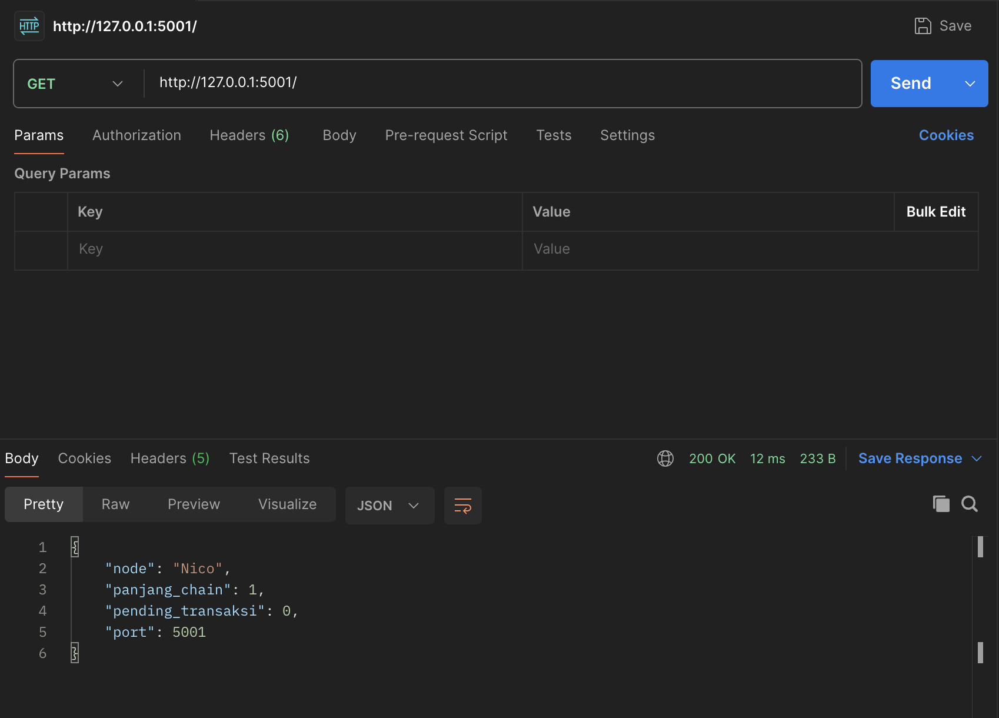
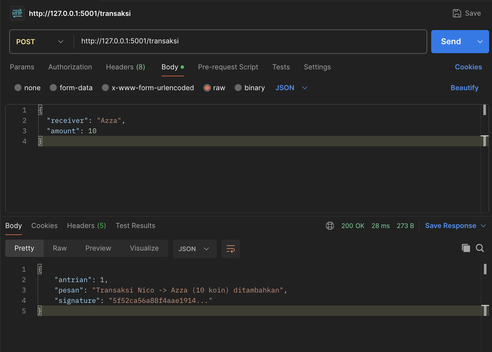

# Assignment 02. Blockchain Fundamentals

## Kelompok

| NRP        | Nama                        |
| ---------- | --------------------------- |
| 5027221042 | Nicholas Marco Weinandra    |
| 5027231071 | Azza Farichi Tjahjono       |
| 5025221100 | Riyanda Cavin Sinambela     |
| 5027221067 | Muhammad Rifqi Oktaviansyah |

---

## Cara Menjalankan

1. Install Dependency

   ```
   pip install -r requirements.txt
   ```

2. Jalankan 3 terminal secara bersamaan dengan perintah berikut:

   **Terminal 1 — Node Nico (port 5001)**

   ```bash
   python node.py Nico 5001
   ```

   **Terminal 2 — Node Azza (port 5002)**

   ```bash
   python node.py Azza 5002
   ```

   **Terminal 3 — Node Riyan (port 5003)**

   ```bash
   python node.py Riyan 5003
   ```

> **Catatan:** Ketiga node harus berjalan bersamaan agar fitur sinkronisasi antar node dapat bekerja dengan baik.

## API Endpoints

| Method | Endpoint             | Deskripsi                                 |
| ------ | -------------------- | ----------------------------------------- |
| GET    | `/`                  | Status node                               |
| POST   | `/transaksi`         | Kirim transaksi baru                      |
| POST   | `/transaksi/terima`  | Terima transaksi dari peer (internal)     |
| POST   | `/mine`              | Mining blok baru                          |
| POST   | `/chain/terima-blok` | Notifikasi blok baru dari peer (internal) |
| GET    | `/chain`             | Lihat seluruh blockchain                  |
| GET    | `/pending`           | Lihat antrian transaksi pending           |

---

## Fitur Blockchain

### 1. Penambahan Transaksi

Kirim transaksi dari salah satu node. Node akan menandatangani transaksi secara otomatis menggunakan private key miliknya, lalu mem-broadcast ke semua peer.

```
POST http://127.0.0.1:5001/transaksi
```

Body:

```json
{
  "receiver": "Azza",
  "amount": 10
}
```

Contoh response:

```json
{
  "pesan": "Transaksi Nico -> Azza (10 koin) ditambahkan",
  "signature": "a3f9d1c7b2e84f01a9...",
  "antrian": 1
}
```

### 2. Mining

Mine semua transaksi yang ada di antrian menjadi sebuah blok baru. Miner mendapat reward **5 koin** dari sistem. Setelah berhasil, blok di-broadcast ke semua peer agar mereka menyinkronisasi chain.

```
POST http://127.0.0.1:5001/mine
```

Contoh response:

```json
{
  "pesan": "Blok #1 berhasil di-mine oleh Nico",
  "nonce": 3271,
  "hash": "000a4f91b2c3d7e8f1...",
  "jumlah_transaksi": 2,
  "reward": "5 koin untuk Nico"
}
```

### 3. Lihat Blockchain

Melihat seluruh isi blockchain pada node tertentu.

```
GET http://127.0.0.1:5001/chain
```

Contoh response:

```json
{
  "node": "Nico",
  "panjang": 2,
  "chain": [
    {
      "index": 0,
      "timestamp": "...",
      "transactions": [],
      "previous_hash": "0000000000000000",
      "nonce": 0,
      "hash": "..."
    },
    {
      "index": 1,
      "transactions": [...],
      "previous_hash": "...",
      "nonce": 3271,
      "hash": "000a4f91b2c3d7e8f1..."
    }
  ]
}
```

### 4. Lihat Antrian Transaksi

Melihat transaksi yang sudah masuk tapi belum di-mine.

```
GET http://127.0.0.1:5001/pending
```

Contoh response:

```json
{
  "node": "Nico",
  "jumlah": 1,
  "antrian": [
    {
      "sender": "Nico",
      "receiver": "Azza",
      "amount": 10,
      "signature": "a3f9d1c7b2e84f01a9..."
    }
  ]
}
```

### 5. Status Node

```
GET http://127.0.0.1:5001/
```

Contoh response:

```json
{
  "node": "Nico",
  "port": 5001,
  "panjang_chain": 2,
  "pending_transaksi": 0
}
```

---

## Dokumentasi Pengujian Fitur

### 1. Status Node

Verifikasi bahwa node berjalan dengan memeriksa status masing-masing node.

- **Method:** `GET`
- **URL:** `http://127.0.0.1:5001/`

**Response:**

```json
{
  "node": "Nico",
  "port": 5001,
  "panjang_chain": 1,
  "pending_transaksi": 0
}
```

**Screenshot Pengujian:**



---

### 2. Penambahan Transaksi

Mengirim transaksi dari Node Nico ke Node Azza. Node akan menandatangani transaksi secara otomatis menggunakan private key miliknya, lalu mem-broadcast ke semua peer.

- **Method:** `POST`
- **URL:** `http://127.0.0.1:5001/transaksi`
- **Headers:** `Content-Type: application/json`

**Request Body:**

```json
{
  "receiver": "Azza",
  "amount": 10
}
```

**Response:**

```json
{
  "antrian": 1,
  "pesan": "Transaksi Nico -> Azza (10 koin) ditambahkan",
  "signature": "5f52ca56a88f4aae1914..."
}
```

**Screenshot Pengujian:**



#### Verifikasi Transaksi Diterima Peer

Setelah mengirim transaksi, cek bahwa Node Azza dan Riyan sudah menerima transaksi tersebut di antrian pending mereka.

- **Method:** `GET`
- **URL:** `http://127.0.0.1:5002/pending`

**Screenshot Pengujian:**


### 3. Proses Mining

Mine semua transaksi yang ada di antrian menjadi sebuah blok baru. Proof of Work dijalankan untuk mencari nonce yang menghasilkan hash dengan prefix `"000"` (difficulty=3).

- **Method:** `POST`
- **URL:** `http://127.0.0.1:5001/mine`

**Response:**

```json
{
  "hash": "000f472ec5f4cb7602c0...",
  "jumlah_transaksi": 2,
  "nonce": 4136,
  "pesan": "Blok #1 berhasil di-mine oleh Nico",
  "reward": "5 koin untuk Nico"
}
```

**Screenshot Pengujian:**


### 4. Reward untuk Miner

Reward sebesar **5 koin** otomatis diberikan kepada miner dari `SYSTEM` setiap kali mining berhasil. Reward ini muncul sebagai salah satu transaksi di dalam blok yang baru di-mine.

Verifikasi reward dengan melihat isi chain setelah mining:

- **Method:** `GET`
- **URL:** `http://127.0.0.1:5001/chain`

**Response:**

```json
{
  "chain": [
    {
      "hash": "f09e8aa1de777fbb9c474768e06c0318a4eedfea44a1379833a5b28fa1e0081b",
      "index": 0,
      "nonce": 0,
      "previous_hash": "0000000000000000",
      "timestamp": "2026-03-26 21:33:04.245961",
      "transactions": []
    },
    {
      "hash": "000f472ec5f4cb7602c06477a5ce2f2c5256435176fbe8b09a0004539ccfebb5",
      "index": 1,
      "nonce": 4136,
      "previous_hash": "f09e8aa1de777fbb9c474768e06c0318a4eedfea44a1379833a5b28fa1e0081b",
      "timestamp": "2026-03-26 21:38:39.769714",
      "transactions": [
        {
          "amount": 10,
          "receiver": "Azza",
          "sender": "Nico",
          "signature": "5f52ca56a88f4aae191479583bd5f0482508fea41125219fff817c29ca300993"
        },
        {
          "amount": 5,
          "receiver": "Nico",
          "sender": "SYSTEM",
          "signature": null
        }
      ]
    }
  ],
  "node": "Nico",
  "panjang": 2
}
```

**Screenshot Pengujian:**


### 5. Validasi Digital Signature

Setiap transaksi ditandatangani menggunakan SHA-256 dari `"sender -> receiver : amount"` + `private_key` milik pengirim. Signature divalidasi saat transaksi masuk ke antrian.

#### Pengujian: Signature Valid

Kirim transaksi normal (signature di-generate otomatis oleh node pengirim):

- **Method:** `POST`
- **URL:** `http://127.0.0.1:5001/transaksi`
- **Body:**

```json
{
  "receiver": "Riyan",
  "amount": 20
}
```

**Screenshot Pengujian:**


#### Pengujian: Signature Tidak Valid (Kasus Negatif)

Simulasi pengiriman transaksi dengan signature palsu langsung ke endpoint internal `/transaksi/terima`:

- **Method:** `POST`
- **URL:** `http://127.0.0.1:5002/transaksi/terima`
- **Body:**

```json
{
  "sender": "Nico",
  "receiver": "Riyan",
  "amount": 9999,
  "signature": "ini_signature_palsu"
}
```

**Response (ditolak):**

```json
{
  "pesan": "Signature Nico tidak valid",
  "ok": false
}
```

**Screenshot Pengujian:**


### 6. Sinkronisasi Antar Node

Setelah Node Nico berhasil mine sebuah blok, blok tersebut di-broadcast ke semua peer. Peer kemudian memanggil fungsi sinkronisasi (`replace_chain`) untuk mengganti chain mereka jika chain yang diterima lebih panjang dan valid.

Verifikasi bahwa chain di Node Azza dan Riyan sudah sinkron dengan Node Nico:

- **Method:** `GET`
- **URL:** `http://127.0.0.1:5002/chain`
- **Method:** `GET`
- **URL:** `http://127.0.0.1:5003/chain`

**Screenshot Pengujian:**

#### Node Azza


#### Node Riyan


## Ringkasan Hasil Pengujian

| #   | Fitur                                | Endpoint                 | Status                |
| --- | ------------------------------------ | ------------------------ | --------------------- |
| 1   | Status Node                          | `GET /`                  | ✅ Berhasil           |
| 2   | Penambahan Transaksi                 | `POST /transaksi`        | ✅ Berhasil           |
| 3   | Proses Mining (Proof of Work)        | `POST /mine`             | ✅ Berhasil           |
| 4   | Reward Miner                         | `GET /chain`             | ✅ Berhasil           |
| 5   | Validasi Digital Signature (valid)   | `POST /transaksi`        | ✅ Berhasil           |
| 5   | Validasi Digital Signature (invalid) | `POST /transaksi/terima` | ✅ Berhasil (ditolak) |
| 6   | Sinkronisasi Antar Node              | `GET /chain`             | ✅ Berhasil           |
